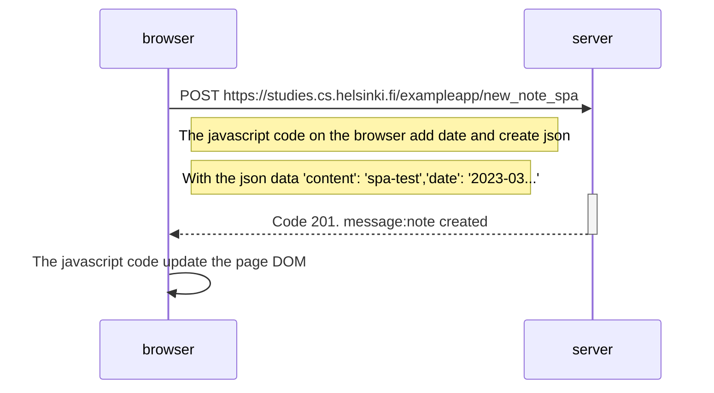

Here is my response to the exercise 0.6:

```mermaid
sequenceDiagram
    participant browser
    participant server
    
    browser->>server: POST https://studies.cs.helsinki.fi/exampleapp/new_note_spa
    Note right of browser: The javascript code on the browser add date and create json
    Note right of browser: With the json data 'content': 'spa-test','date': '2023-03...'
    activate server
    server-->>browser: Code 201. message:note created
    deactivate server
    browser->>browser: The javascript code update the page DOM

```